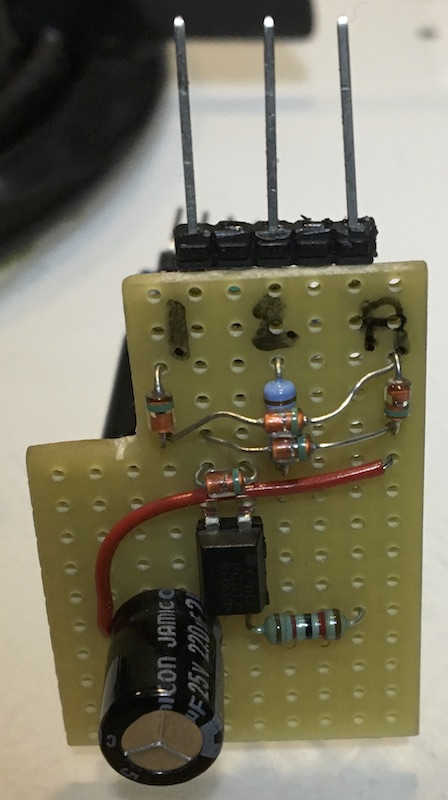
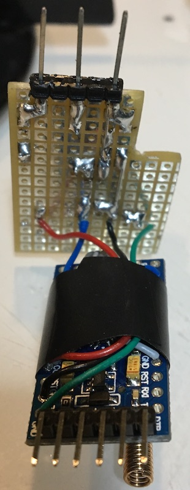

# TeleinfoOwl

Emulate the OWL CM180 Energy Monitor using "TeleInfo"

The following libs are used:

rf433 lib: https://github.com/tazounet/OwlSender

teleinfo lib: https://github.com/tazounet/TeleInfo

# Linky

Uses the 3 TeleInfo contacts of linky.

1 & 2: TeleInfo data

1 & A: Power

# Hardware

- Arduino Pro Mini 5V (https://store.arduino.cc/arduino-pro-mini)
- 4 diodes to make a rectifier (Pin 1 & A)
- An optocoupler SFH620A (but I used a LTV-817 + a diode)
- A 1.2k resistor
- a 10k resistor
- A 433MHz transmitter (I used a SYN115)

 
